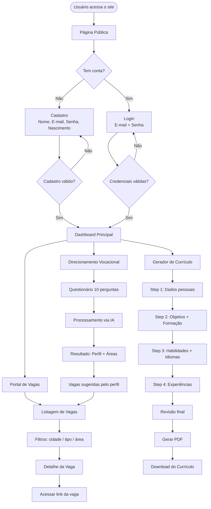
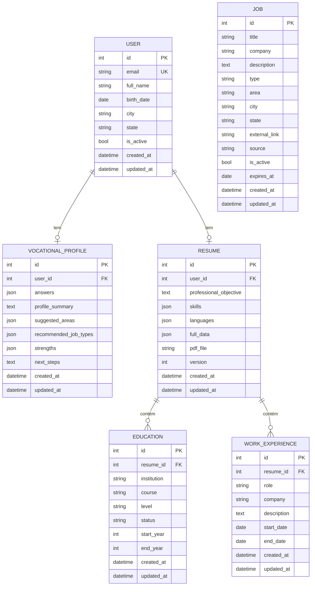

# PRD — Conectando Futuro
**Versão:** 3.0
**Data:** Abril/2026
**Status:** Aprovado para desenvolvimento

---

## 1. Visão Geral

**Conectando Futuro** é uma plataforma web de empregabilidade juvenil que conecta jovens a
oportunidades de trabalho, orienta escolhas profissionais e apoia a preparação para processos
seletivos. Em uma única jornada integrada, o jovem descobre seu perfil profissional, encontra
vagas compatíveis e gera um currículo pronto para candidatura.

O projeto responde ao **2º Desafio da EPT-PR**:
> _"Ideias que Inspiram, Soluções que Transformam — Como as ideias e soluções criadas nos
> cursos da EPT podem responder problemas reais do mundo do trabalho e contribuir para
> melhorar vidas e processos?"_

---

## 2. Sobre o Produto

O **Conectando Futuro** é uma aplicação web Django full stack, com interface moderna,
responsiva e acessível, construída sobre Django Template Language e TailwindCSS.
O produto integra três módulos principais:

1. **Portal de Vagas** — listagem e filtro de oportunidades regionais para jovens
2. **Direcionamento Vocacional** — questionário com análise de perfil via IA
3. **Gerador de Currículo** — formulário guiado com exportação em PDF

A plataforma conta com uma página pública de apresentação e um dashboard privado acessível
após autenticação.

---

## 3. Propósito

Reduzir as barreiras de entrada de jovens no mercado de trabalho, oferecendo em um único
lugar: descoberta de perfil, acesso a vagas e preparação documental para candidaturas,
com linguagem acessível e experiência simples.

---

## 4. Público-Alvo

| Segmento | Descrição |
|---|---|
| **Prioritário** | Estudantes do ensino médio (15–18 anos) |
| **Prioritário** | Estudantes de cursos técnicos (15–20 anos) |
| **Prioritário** | Jovens recém-egressos em busca do primeiro emprego (18–24 anos) |
| **Ampliado** | Qualquer jovem em inserção inicial no mercado de trabalho |

---

## 5. Objetivos

- Centralizar vagas regionais voltadas a jovens em início de carreira
- Facilitar acesso a estágio, jovem aprendiz e primeiro emprego
- Oferecer orientação vocacional com apoio de IA
- Permitir geração de currículo em PDF de forma guiada e simples
- Apoiar a transição entre escola e mercado de trabalho

---

## 6. Requisitos Funcionais

### 6.1 Site Público

- RF01 — Exibir página inicial pública com apresentação da plataforma
- RF02 — Disponibilizar botões de "Cadastre-se" e "Entrar" na página pública
- RF03 — Exibir seções: hero, como funciona, benefícios e chamada para ação

### 6.2 Autenticação

- RF04 — Permitir cadastro de usuário com nome completo, e-mail, senha e data de nascimento
- RF05 — Autenticar usuário via e-mail (substituindo o username padrão do Django)
- RF06 — Redirecionar para o dashboard após login bem-sucedido
- RF07 — Permitir logout do sistema
- RF08 — Exibir mensagens de erro de autenticação em português

### 6.3 Dashboard

- RF09 — Exibir painel principal após login com resumo dos módulos
- RF10 — Indicar progresso do usuário (perfil preenchido, currículo gerado, vagas visualizadas)
- RF11 — Disponibilizar acesso rápido aos três módulos

### 6.4 Portal de Vagas

- RF12 — Listar vagas com paginação (12 por página)
- RF13 — Filtrar vagas por cidade, tipo (estágio/aprendiz/primeiro emprego) e área
- RF14 — Exibir página de detalhe de cada vaga
- RF15 — Permitir cadastro de vagas pelo admin do Django
- RF16 — Ocultar automaticamente vagas expiradas

### 6.5 Direcionamento Vocacional

- RF17 — Exibir questionário vocacional com 10 perguntas de múltipla escolha
- RF18 — Salvar respostas e enviar para análise via IA (OpenRouter)
- RF19 — Exibir resultado com: resumo de perfil, áreas sugeridas e próximos passos
- RF20 — Mostrar vagas filtradas pelo perfil gerado no resultado

### 6.6 Gerador de Currículo

- RF21 — Exibir formulário multi-step para preenchimento do currículo
- RF22 — Permitir informar: dados pessoais, objetivo, formação, habilidades, idiomas e experiências
- RF23 — Gerar PDF do currículo via WeasyPrint
- RF24 — Disponibilizar link de download do PDF gerado
- RF25 — Permitir reedição e regeneração do currículo

---

### 6.7 Fluxo de UX — Diagrama Mermaid



---

## 7. Requisitos Não-Funcionais

| ID | Requisito | Detalhe |
|---|---|---|
| RNF01 | **Stack full stack Django** | Sem SPA, sem Vue, sem React. Django Template Language + TailwindCSS |
| RNF02 | **Design responsivo** | Mobile-first, funcional em 320px+ |
| RNF03 | **Design system coeso** | Mesma identidade visual em todas as telas |
| RNF04 | **Autenticação por e-mail** | Substituir `USERNAME_FIELD` para `email` |
| RNF05 | **PEP8** | Todo código Python segue PEP8, aspas simples |
| RNF06 | **Inglês no código** | Variáveis, funções, classes, arquivos em inglês |
| RNF07 | **Português na interface** | Todo texto visível ao usuário em pt-BR |
| RNF08 | **Class Based Views** | Preferência absoluta por CBVs nativas do Django |
| RNF09 | **Apps por domínio** | Cada entidade do sistema em sua própria app Django |
| RNF10 | **created_at / updated_at** | Todo model deve ter esses dois campos |
| RNF11 | **Signals isolados** | Signals em `signals.py` dentro da app correspondente |
| RNF12 | **Simplicidade** | Nenhuma funcionalidade além do especificado |
| RNF13 | **Performance** | Resposta da API < 500ms; PDF < 10s |
| RNF14 | **LGPD** | Dados pessoais tratados com transparência |

---

## 8. Arquitetura Técnica

### 8.1 Stack

| Camada | Tecnologia | Versão |
|---|---|---|
| **Linguagem** | Python | 3.12+ |
| **Framework web** | Django | 5.x |
| **ORM / Banco** | Django ORM + SQLite (dev) / PostgreSQL (prod) | — |
| **Frontend** | Django Template Language + TailwindCSS | 3.x |
| **Tarefas assíncronas** | Celery + Redis | 5.x / 7.x |
| **IA Vocacional** | OpenRouter API (Claude Haiku) | — |
| **Geração PDF** | WeasyPrint | 62.x |
| **Servidor (prod)** | Gunicorn + Nginx | — |
| **Admin** | Django Admin nativo | — |

### 8.2 Estrutura de Apps Django

```
conectando_futuro/          ← projeto Django (settings, urls, wsgi)
├── core/                   ← app base: landing page, dashboard, mixins
├── accounts/               ← autenticação por e-mail, modelo de usuário
├── jobs/                   ← portal de vagas
├── vocational/             ← questionário + análise de perfil IA
└── resume/                 ← gerador de currículo em PDF
```

### 8.3 Schema de Dados — Diagrama Mermaid



---

## 9. Design System

### 9.1 Identidade Visual

O design do **Conectando Futuro** é moderno, escuro e com gradientes vibrantes.
A paleta comunica tecnologia, confiança e juventude.

### 9.2 Paleta de Cores

```
Fundo principal:     #0F0F1A  (slate-950 / quase preto)
Fundo card/surface:  #1A1A2E  (slate-900 levemente azulado)
Fundo elevado:       #16213E  (azul escuro profundo)

Gradiente primário:  from-violet-600 via-purple-600 to-indigo-600
Gradiente accent:    from-cyan-500 to-blue-600
Gradiente hero:      from-violet-900 via-slate-900 to-indigo-900

Texto principal:     #F1F5F9  (slate-100)
Texto secundário:    #94A3B8  (slate-400)
Texto muted:         #64748B  (slate-500)

Borda sutil:         #1E293B  (slate-800)
Borda destaque:      #6D28D9  (violet-700)

Sucesso:             #10B981  (emerald-500)
Erro:                #EF4444  (red-500)
Aviso:               #F59E0B  (amber-500)
Info:                #3B82F6  (blue-500)
```

### 9.3 Tipografia

```html
<!-- Google Fonts no base.html -->
<link href="https://fonts.googleapis.com/css2?family=Inter:wght@300;400;500;600;700;800&display=swap" rel="stylesheet">

<!-- Aplicação via Tailwind -->
<body class="font-sans antialiased bg-[#0F0F1A] text-slate-100">
```

| Uso | Classe Tailwind |
|---|---|
| Título hero | `text-4xl md:text-6xl font-extrabold tracking-tight` |
| Título de página | `text-2xl md:text-3xl font-bold` |
| Subtítulo | `text-lg font-semibold text-slate-300` |
| Corpo | `text-sm md:text-base font-normal text-slate-300` |
| Caption / label | `text-xs font-medium text-slate-400 uppercase tracking-wider` |

### 9.4 Botões

```html
<!-- Botão primário com gradiente -->
<button class="inline-flex items-center gap-2 px-6 py-3 rounded-xl
               bg-gradient-to-r from-violet-600 to-indigo-600
               hover:from-violet-500 hover:to-indigo-500
               text-white font-semibold text-sm
               shadow-lg shadow-violet-500/25
               transition-all duration-200 focus:outline-none
               focus:ring-2 focus:ring-violet-500 focus:ring-offset-2
               focus:ring-offset-slate-900">
  Entrar
</button>

<!-- Botão secundário (outline) -->
<button class="inline-flex items-center gap-2 px-6 py-3 rounded-xl
               border border-slate-700 hover:border-violet-500
               text-slate-300 hover:text-white font-semibold text-sm
               bg-transparent hover:bg-slate-800/50
               transition-all duration-200">
  Saiba mais
</button>

<!-- Botão ghost (link-like) -->
<button class="inline-flex items-center gap-1 text-violet-400
               hover:text-violet-300 font-medium text-sm
               transition-colors duration-200">
  Ver todas as vagas →
</button>

<!-- Botão de perigo -->
<button class="inline-flex items-center gap-2 px-4 py-2 rounded-lg
               bg-red-500/10 hover:bg-red-500/20 border border-red-500/30
               text-red-400 hover:text-red-300 font-medium text-sm
               transition-all duration-200">
  Excluir
</button>
```

### 9.5 Inputs e Formulários

```html
<!-- Label padrão -->
<label class="block text-xs font-medium text-slate-400 uppercase tracking-wider mb-1.5">
  E-mail
</label>

<!-- Input padrão -->
<input type="email"
       class="w-full px-4 py-3 rounded-xl
              bg-slate-800/60 border border-slate-700
              text-slate-100 placeholder-slate-500
              focus:outline-none focus:ring-2 focus:ring-violet-500
              focus:border-transparent
              transition-all duration-200 text-sm">

<!-- Select padrão -->
<select class="w-full px-4 py-3 rounded-xl
               bg-slate-800/60 border border-slate-700
               text-slate-100
               focus:outline-none focus:ring-2 focus:ring-violet-500
               focus:border-transparent transition-all duration-200 text-sm">

<!-- Textarea padrão -->
<textarea class="w-full px-4 py-3 rounded-xl
                 bg-slate-800/60 border border-slate-700
                 text-slate-100 placeholder-slate-500
                 focus:outline-none focus:ring-2 focus:ring-violet-500
                 focus:border-transparent resize-none
                 transition-all duration-200 text-sm" rows="4">
</textarea>

<!-- Mensagem de erro no campo -->
<p class="mt-1.5 text-xs text-red-400 flex items-center gap-1">
  <svg class="w-3 h-3">...</svg>
  Campo obrigatório
</p>

<!-- Container de formulário -->
<form class="space-y-5">
  <div class="space-y-1.5">
    <!-- label + input -->
  </div>
</form>
```

### 9.6 Cards

```html
<!-- Card padrão -->
<div class="bg-slate-900/60 border border-slate-800 rounded-2xl p-6
            hover:border-slate-700 transition-all duration-200
            backdrop-blur-sm">
</div>

<!-- Card com destaque gradiente na borda -->
<div class="relative rounded-2xl p-px
            bg-gradient-to-br from-violet-600/30 via-slate-800 to-indigo-600/20">
  <div class="bg-slate-900 rounded-2xl p-6">
    <!-- conteúdo -->
  </div>
</div>

<!-- Card de vaga -->
<div class="bg-slate-900/60 border border-slate-800 rounded-2xl p-5
            hover:border-violet-500/50 hover:shadow-lg hover:shadow-violet-500/10
            transition-all duration-300 cursor-pointer group">
</div>
```

### 9.7 Grid e Layout

```html
<!-- Container principal -->
<div class="max-w-7xl mx-auto px-4 sm:px-6 lg:px-8">

<!-- Grid de vagas (3 colunas) -->
<div class="grid grid-cols-1 md:grid-cols-2 lg:grid-cols-3 gap-5">

<!-- Grid de dashboard (2+1) -->
<div class="grid grid-cols-1 lg:grid-cols-3 gap-6">
  <div class="lg:col-span-2">...</div>
  <div>...</div>
</div>

<!-- Seção com divisor -->
<section class="py-16 md:py-24">
```

### 9.8 Navegação (Navbar)

```html
<!-- Navbar autenticado -->
<nav class="sticky top-0 z-50 border-b border-slate-800/80
            bg-slate-950/80 backdrop-blur-md">
  <div class="max-w-7xl mx-auto px-4 sm:px-6 lg:px-8">
    <div class="flex items-center justify-between h-16">

      <!-- Logo -->
      <a href="/" class="flex items-center gap-2">
        <span class="text-lg font-bold bg-gradient-to-r from-violet-400
                     to-indigo-400 bg-clip-text text-transparent">
          Conectando Futuro
        </span>
      </a>

      <!-- Links (desktop) -->
      <div class="hidden md:flex items-center gap-1">
        <a href="/vagas/" class="px-4 py-2 rounded-lg text-sm font-medium
                                  text-slate-400 hover:text-slate-100
                                  hover:bg-slate-800 transition-all duration-200">
          Vagas
        </a>
        <!-- ... -->
      </div>

      <!-- Avatar / logout -->
      <div class="flex items-center gap-3">
        <span class="text-sm text-slate-400">Olá, {{ user.first_name }}</span>
        <a href="/sair/" class="px-4 py-2 rounded-lg text-sm font-medium
                                 text-slate-400 hover:text-red-400
                                 hover:bg-red-500/10 transition-all duration-200">
          Sair
        </a>
      </div>

    </div>
  </div>
</nav>
```

### 9.9 Badges e Tags

```html
<!-- Badge de tipo de vaga -->
<span class="inline-flex items-center px-2.5 py-0.5 rounded-full text-xs
             font-medium bg-violet-500/15 text-violet-300 border border-violet-500/30">
  Estágio
</span>

<span class="inline-flex items-center px-2.5 py-0.5 rounded-full text-xs
             font-medium bg-cyan-500/15 text-cyan-300 border border-cyan-500/30">
  Jovem Aprendiz
</span>

<span class="inline-flex items-center px-2.5 py-0.5 rounded-full text-xs
             font-medium bg-emerald-500/15 text-emerald-300 border border-emerald-500/30">
  Primeiro Emprego
</span>
```

### 9.10 Alertas / Mensagens Django

```html
<!-- messages do Django -->

<div class="flex items-start gap-3 px-4 py-3 rounded-xl border text-sm
            
              bg-emerald-500/10 border-emerald-500/30 text-emerald-300
            
              bg-red-500/10 border-red-500/30 text-red-300
            
              bg-blue-500/10 border-blue-500/30 text-blue-300
            ">
  {{ message }}
</div>

```

### 9.11 Base Template

```html
<!-- templates/base.html -->
<!DOCTYPE html>
<html lang="pt-BR" class="dark">
<head>
  <meta charset="UTF-8">
  <meta name="viewport" content="width=device-width, initial-scale=1.0">
  <title>Conectando Futuro</title>
  <script src="https://cdn.tailwindcss.com"></script>
  <link href="https://fonts.googleapis.com/css2?family=Inter:wght@300;400;500;600;700;800&display=swap" rel="stylesheet">
  <script>
    tailwind.config = {
      theme: {
        extend: {
          fontFamily: { sans: ['Inter', 'sans-serif'] }
        }
      }
    }
  </script>
  
</head>
<body class="bg-[#0F0F1A] text-slate-100 font-sans antialiased min-h-screen">

  

  <main>
    
    
  </main>

  

  
</body>
</html>
```

---

## 10. User Stories

### Épico 1 — Acesso à Plataforma

**US01 — Cadastro de usuário**
> Como jovem em busca de emprego, quero me cadastrar na plataforma para acessar os recursos disponíveis.

**Critérios de aceite:**
- [ ] O formulário exige: nome completo, e-mail, senha, confirmação de senha e data de nascimento
- [ ] O e-mail deve ser único no sistema
- [ ] A senha deve ter no mínimo 8 caracteres
- [ ] Após cadastro bem-sucedido, o usuário é redirecionado ao dashboard
- [ ] Mensagens de erro são exibidas em português

---

**US02 — Login por e-mail**
> Como usuário cadastrado, quero fazer login com meu e-mail e senha para acessar minha conta.

**Critérios de aceite:**
- [ ] O campo de login aceita e-mail (não username)
- [ ] Credenciais inválidas exibem mensagem de erro clara
- [ ] Após login bem-sucedido, redireciona para o dashboard
- [ ] Sessão mantida com cookie seguro

---

**US03 — Logout**
> Como usuário autenticado, quero sair da minha conta para encerrar minha sessão.

**Critérios de aceite:**
- [ ] Botão de logout visível na navbar
- [ ] Após logout, redireciona para a página pública
- [ ] Sessão encerrada no servidor

---

### Épico 2 — Portal de Vagas

**US04 — Listagem de vagas**
> Como jovem, quero ver as vagas disponíveis para encontrar oportunidades compatíveis com meu perfil.

**Critérios de aceite:**
- [ ] Vagas exibidas em cards com: título, empresa, cidade, tipo e data
- [ ] Paginação de 12 vagas por página
- [ ] Apenas vagas ativas e não expiradas são exibidas
- [ ] Layout responsivo em 1, 2 e 3 colunas

---

**US05 — Filtro de vagas**
> Como jovem, quero filtrar as vagas por cidade, tipo e área para encontrar o que preciso.

**Critérios de aceite:**
- [ ] Filtros disponíveis: cidade, tipo (estágio/aprendiz/primeiro emprego) e área
- [ ] Filtros aplicados sem recarregar a página (ou com submit de formulário)
- [ ] Exibe contagem de resultados encontrados
- [ ] Botão de limpar filtros disponível

---

**US06 — Detalhe da vaga**
> Como jovem, quero ver todos os detalhes de uma vaga para decidir se devo me candidatar.

**Critérios de aceite:**
- [ ] Página exibe: título, empresa, descrição completa, requisitos, cidade, tipo
- [ ] Botão "Candidatar-se" redireciona para link externo (nova aba)
- [ ] Botão "Voltar" retorna à listagem

---

### Épico 3 — Direcionamento Vocacional

**US07 — Questionário vocacional**
> Como jovem, quero responder um questionário para descobrir meu perfil profissional.

**Critérios de aceite:**
- [ ] Questionário com 10 perguntas de múltipla escolha
- [ ] Uma pergunta exibida por vez (ou todas em scroll)
- [ ] Todas as perguntas devem ser respondidas antes do envio
- [ ] Feedback visual de progresso (ex: "4 de 10")

---

**US08 — Resultado vocacional**
> Como jovem, quero ver o resultado da análise do meu perfil com sugestões de áreas profissionais.

**Critérios de aceite:**
- [ ] Exibe: resumo do perfil, áreas sugeridas, pontos fortes e próximos passos
- [ ] Exibe vagas filtradas pelas áreas sugeridas
- [ ] Resultado salvo e acessível no dashboard
- [ ] Possibilidade de refazer o questionário

---

### Épico 4 — Gerador de Currículo

**US09 — Preenchimento do currículo**
> Como jovem, quero preencher meus dados profissionais para gerar um currículo.

**Critérios de aceite:**
- [ ] Formulário dividido em etapas: dados pessoais, objetivo/formação, habilidades/idiomas, experiências
- [ ] Dados salvos a cada etapa (sem perder ao navegar)
- [ ] Navegação entre steps (anterior / próximo)
- [ ] Campos opcionais claramente indicados

---

**US10 — Geração e download do PDF**
> Como jovem, quero gerar meu currículo em PDF para usar nas candidaturas.

**Critérios de aceite:**
- [ ] Botão "Gerar currículo" disponível após preenchimento
- [ ] PDF gerado em background e disponível para download
- [ ] Link de download visível após geração
- [ ] Possibilidade de reeditar e regenerar
- [ ] PDF com layout limpo e adequado para impressão A4

---

## 11. Métricas de Sucesso

### KPIs de Produto

| KPI | Meta MVP | Como medir |
|---|---|---|
| Cadastros realizados | > 50 usuários | `User.objects.count()` |
| Questionários vocacionais concluídos | > 70% dos cadastros | `VocationalProfile.objects.count()` |
| Currículos gerados | > 60% dos cadastros | `Resume.objects.filter(pdf_file__isnull=False).count()` |
| Vagas cadastradas | > 20 vagas ativas | `Job.objects.filter(is_active=True).count()` |

### KPIs de Experiência do Usuário

| KPI | Meta | Observação |
|---|---|---|
| Taxa de conclusão do questionário | > 80% | Perguntas iniciadas vs. concluídas |
| Taxa de conclusão do currículo | > 65% | Step 1 iniciado vs. PDF gerado |
| Tempo médio de geração do PDF | < 10 segundos | Celery task duration |
| Erros de interface reportados | 0 críticos | Feedback e observação direta |

### KPIs de Avaliação (contexto EPT-PR)

| KPI | Meta |
|---|---|
| Demonstração funcional completa | Fluxo end-to-end sem erros |
| Aderência ao tema do desafio | Validação pela banca |
| Clareza na apresentação | Feedback positivo da banca |

---

## 12. Riscos e Mitigações

| # | Risco | Probabilidade | Impacto | Mitigação |
|---|---|---|---|---|
| R01 | Instabilidade da API OpenRouter para análise vocacional | Média | Alto | Implementar fallback com análise por regras simples se API falhar |
| R02 | Geração de PDF lenta para demo | Média | Médio | Gerar PDF de forma síncrona no MVP (sem Celery); Celery em sprint posterior |
| R03 | Poucas vagas cadastradas para a demo | Alta | Médio | Pré-popular banco com vagas reais de Curitiba/PR manualmente |
| R04 | Complexidade excessiva do formulário multi-step | Média | Médio | Simplificar para formulário único com seções colapsáveis no MVP |
| R05 | TailwindCSS via CDN lento em conexões lentas | Baixa | Baixo | Usar CDN com fallback local; minificar em produção |
| R06 | Tempo insuficiente para todas as sprints | Alta | Alto | Priorizar P0: auth + vagas + currículo simples; vocacional como P1 |

---

## 13. Lista de Tarefas por Sprint

---

### SPRINT 0 — Setup e Fundação
**Objetivo:** Projeto Django funcionando com estrutura base, design system e autenticação.

---

#### 1.0 Setup do Projeto

- [ ] **1.1** Criar ambiente virtual Python (`python -m venv .venv`)
- [ ] **1.2** Instalar dependências iniciais (`django`, `pillow`, `python-decouple`, `weasyprint`, `openai`, `celery`, `redis`)
- [ ] **1.3** Criar projeto Django: `django-admin startproject conectando_futuro .`
- [ ] **1.4** Configurar `settings.py` para usar `python-decouple` com arquivo `.env`
- [ ] **1.5** Criar arquivo `.env` com `SECRET_KEY`, `DEBUG=True`, `ALLOWED_HOSTS`
- [ ] **1.6** Criar arquivo `.gitignore` excluindo `.env`, `__pycache__`, `*.pyc`, `db.sqlite3`, `media/`
- [ ] **1.7** Criar repositório Git e fazer commit inicial

#### 2.0 Estrutura de Apps

- [ ] **2.1** Criar app `core`: `python manage.py startapp core`
- [ ] **2.2** Criar app `accounts`: `python manage.py startapp accounts`
- [ ] **2.3** Criar app `jobs`: `python manage.py startapp jobs`
- [ ] **2.4** Criar app `vocational`: `python manage.py startapp vocational`
- [ ] **2.5** Criar app `resume`: `python manage.py startapp resume`
- [ ] **2.6** Registrar todas as apps em `INSTALLED_APPS` no `settings.py`
- [ ] **2.7** Criar arquivo `urls.py` em cada app
- [ ] **2.8** Incluir as urls das apps no `urls.py` principal com `include()`

#### 3.0 Estrutura de Templates

- [ ] **3.1** Criar pasta `templates/` na raiz do projeto
- [ ] **3.2** Configurar `TEMPLATES['DIRS']` no `settings.py` para apontar para `templates/`
- [ ] **3.3** Criar `templates/base.html` com estrutura HTML5 completa (ver seção 9.11)
- [ ] **3.4** Criar `templates/partials/navbar.html` com navbar escura e logo
- [ ] **3.5** Criar `templates/partials/footer.html` com footer simples
- [ ] **3.6** Criar `templates/partials/messages.html` com renderização das mensagens Django
- [ ] **3.7** Criar subpastas: `templates/core/`, `templates/accounts/`, `templates/jobs/`, `templates/vocational/`, `templates/resume/`

#### 4.0 Design System Base

- [ ] **4.1** Configurar TailwindCSS via CDN no `base.html` com bloco `extra_head`
- [ ] **4.2** Definir `tailwind.config` inline com fonte Inter e cores customizadas
- [ ] **4.3** Adicionar link do Google Fonts (Inter) no `base.html`
- [ ] **4.4** Criar `templates/partials/button_primary.html` com include reutilizável
- [ ] **4.5** Testar design system criando uma página de rascunho com todos os componentes

---

### SPRINT 1 — Autenticação e Site Público
**Objetivo:** Landing page pública + cadastro + login por e-mail + dashboard básico.

---

#### 5.0 Model de Usuário Customizado

- [ ] **5.1** Em `accounts/models.py`, criar `User(AbstractBaseUser, PermissionsMixin)` com campos: `email`, `full_name`, `birth_date`, `city`, `state`, `is_active`, `is_staff`, `created_at`, `updated_at`
- [ ] **5.2** Criar `UserManager(BaseUserManager)` com métodos `create_user()` e `create_superuser()` usando `email` como campo de identificação
- [ ] **5.3** Definir `USERNAME_FIELD = 'email'` e `REQUIRED_FIELDS = ['full_name']` no model
- [ ] **5.4** No `settings.py`, definir `AUTH_USER_MODEL = 'accounts.User'`
- [ ] **5.5** Gerar e aplicar migrations: `python manage.py makemigrations accounts && python manage.py migrate`
- [ ] **5.6** Criar superuser de teste: `python manage.py createsuperuser`

#### 6.0 Autenticação — Backend

- [ ] **6.1** Em `accounts/forms.py`, criar `RegisterForm(forms.ModelForm)` com campos: `full_name`, `email`, `birth_date`, `password1`, `password2`
- [ ] **6.2** Em `accounts/forms.py`, criar `LoginForm(forms.Form)` com campos: `email`, `password`
- [ ] **6.3** Em `accounts/views.py`, criar `RegisterView(FormView)` que cria o usuário, faz login automático e redireciona para dashboard
- [ ] **6.4** Em `accounts/views.py`, criar `LoginView(FormView)` que autentica via `authenticate(email=..., password=...)` e redireciona para dashboard
- [ ] **6.5** Em `accounts/views.py`, criar `LogoutView(View)` que chama `logout(request)` e redireciona para home
- [ ] **6.6** Em `accounts/urls.py`, registrar rotas: `/cadastro/`, `/entrar/`, `/sair/`
- [ ] **6.7** Criar `accounts/backends.py` com `EmailBackend(ModelBackend)` que autentica por e-mail
- [ ] **6.8** No `settings.py`, definir `AUTHENTICATION_BACKENDS = ['accounts.backends.EmailBackend']`

#### 7.0 Autenticação — Templates

- [ ] **7.1** Criar `templates/accounts/register.html` com formulário de cadastro seguindo design system (fundo escuro, card central, gradiente)
- [ ] **7.2** Criar `templates/accounts/login.html` com formulário de login seguindo design system
- [ ] **7.3** Adicionar validação visual de erros por campo nos dois formulários
- [ ] **7.4** Adicionar link "Já tem conta? Entrar" no cadastro e "Não tem conta? Cadastre-se" no login
- [ ] **7.5** Testar fluxo completo: cadastro → login → logout

#### 8.0 Site Público — Landing Page

- [ ] **8.1** Em `core/views.py`, criar `HomeView(TemplateView)` com `template_name = 'core/home.html'`
- [ ] **8.2** Em `core/urls.py`, registrar rota `/` para `HomeView`
- [ ] **8.3** Criar `templates/core/home.html` herdando de `base.html`
- [ ] **8.4** Implementar seção **Hero**: título principal com gradiente, subtítulo, botões "Cadastre-se" e "Entrar", background com gradiente `from-violet-900 via-slate-900 to-indigo-900`
- [ ] **8.5** Implementar seção **Como Funciona**: 3 cards horizontais com ícones e descrição dos módulos (Vagas, Vocacional, Currículo)
- [ ] **8.6** Implementar seção **Por que usar**: lista de benefícios com ícones check
- [ ] **8.7** Implementar seção **CTA Final**: fundo gradiente com botão de cadastro
- [ ] **8.8** Navbar pública com logo e botões "Entrar" / "Cadastre-se" (sem links internos autenticados)
- [ ] **8.9** Redirecionar usuários já autenticados de `/` para `/dashboard/`

#### 9.0 Dashboard Principal

- [ ] **9.1** Criar mixin `LoginRequiredMixin` personalizado ou usar o nativo do Django em todas as views autenticadas
- [ ] **9.2** Em `core/views.py`, criar `DashboardView(LoginRequiredMixin, TemplateView)` com `template_name = 'core/dashboard.html'`
- [ ] **9.3** Em `core/urls.py`, registrar rota `/dashboard/`
- [ ] **9.4** Criar `templates/core/dashboard.html` com navbar autenticada
- [ ] **9.5** Implementar 3 cards de acesso rápido: Vagas, Vocacional, Currículo — com ícone, título, descrição curta e botão
- [ ] **9.6** Implementar card de boas-vindas com nome do usuário
- [ ] **9.7** Atualizar `navbar.html` para exibir versão autenticada (nome do usuário + logout) quando `user.is_authenticated`

---

### SPRINT 2 — Portal de Vagas
**Objetivo:** Listagem, filtro e detalhe de vagas funcionando.

---

#### 10.0 Model de Vagas

- [ ] **10.1** Em `jobs/models.py`, criar `Job(models.Model)` com campos: `title`, `company`, `description`, `job_type` (choices: estagio/aprendiz/primeiro_emprego), `area`, `city`, `state`, `external_link`, `source` (choices: manual/automatico), `is_active`, `expires_at`, `created_at`, `updated_at`
- [ ] **10.2** Adicionar método `__str__` retornando `f'{self.title} — {self.company}'`
- [ ] **10.3** Adicionar propriedade `is_expired` verificando se `expires_at` é passado
- [ ] **10.4** Adicionar método de classe `Job.objects.active()` via `Manager` customizado filtrando `is_active=True` e `expires_at > hoje`
- [ ] **10.5** Gerar e aplicar migrations: `python manage.py makemigrations jobs && python manage.py migrate`
- [ ] **10.6** Registrar model no `jobs/admin.py` com `list_display`, `list_filter` e `search_fields`
- [ ] **10.7** Popular banco com 15–20 vagas de teste via fixtures ou pelo Django Admin

#### 11.0 Views de Vagas

- [ ] **11.1** Em `jobs/views.py`, criar `JobListView(LoginRequiredMixin, ListView)` com `model = Job`, `template_name = 'jobs/job_list.html'`, `paginate_by = 12`
- [ ] **11.2** Sobrescrever `get_queryset()` para aplicar filtros via `request.GET`: `city`, `job_type`, `area`
- [ ] **11.3** Sobrescrever `get_context_data()` para passar filtros ativos ao template
- [ ] **11.4** Em `jobs/views.py`, criar `JobDetailView(LoginRequiredMixin, DetailView)` com `model = Job`, `template_name = 'jobs/job_detail.html'`
- [ ] **11.5** Em `jobs/urls.py`, registrar rotas: `/vagas/` e `/vagas/<int:pk>/`

#### 12.0 Templates de Vagas

- [ ] **12.1** Criar `templates/jobs/job_list.html` com grid de cards (1/2/3 colunas responsivo)
- [ ] **12.2** Implementar card de vaga com: título, empresa, cidade, badge de tipo, data de criação, botão "Ver detalhes"
- [ ] **12.3** Implementar formulário de filtros lateral ou no topo: selects de cidade, tipo, área + botão aplicar + botão limpar
- [ ] **12.4** Implementar paginação com botões anterior/próximo e indicador de página
- [ ] **12.5** Implementar estado vazio: mensagem e ícone quando não há vagas no filtro
- [ ] **12.6** Criar `templates/jobs/job_detail.html` com layout de detalhe completo
- [ ] **12.7** Exibir no detalhe: título, empresa, tipo (badge), cidade/estado, descrição completa, botão "Candidatar-se" (link externo `target="_blank"`) e botão "Voltar"
- [ ] **12.8** Adicionar link "Vagas" na navbar autenticada

---

### SPRINT 3 — Direcionamento Vocacional
**Objetivo:** Questionário + análise IA + resultado com áreas sugeridas.

---

#### 13.0 Models Vocacional

- [ ] **13.1** Em `vocational/models.py`, criar `Question(models.Model)` com campos: `text`, `order`, `created_at`, `updated_at`
- [ ] **13.2** Criar `QuestionOption(models.Model)` com campos: `question (FK)`, `text`, `value` (str para uso no prompt), `order`, `created_at`, `updated_at`
- [ ] **13.3** Criar `VocationalProfile(models.Model)` com campos: `user (OneToOne)`, `answers (JSONField)`, `profile_summary (TextField)`, `suggested_areas (JSONField)`, `recommended_job_types (JSONField)`, `strengths (JSONField)`, `next_steps (TextField)`, `created_at`, `updated_at`
- [ ] **13.4** Gerar e aplicar migrations
- [ ] **13.5** Registrar models no `vocational/admin.py`
- [ ] **13.6** Popular banco com 10 perguntas vocacionais via fixture ou admin

#### 14.0 Views Vocacional

- [ ] **14.1** Em `vocational/views.py`, criar `QuestionnaireView(LoginRequiredMixin, TemplateView)` que carrega todas as perguntas e opções
- [ ] **14.2** Criar `SubmitAnswersView(LoginRequiredMixin, View)` que recebe `POST` com respostas em JSON, salva em `VocationalProfile.answers` e dispara análise
- [ ] **14.3** Criar função `analyze_profile(profile_id)` em `vocational/services.py` que monta o prompt e chama a OpenRouter API
- [ ] **14.4** Implementar parsing da resposta JSON da IA e salvar campos no `VocationalProfile`
- [ ] **14.5** Implementar fallback: se a API falhar, salvar perfil com análise padrão genérica
- [ ] **14.6** Criar `VocationalResultView(LoginRequiredMixin, TemplateView)` que exibe o resultado e vagas filtradas pelas `suggested_areas`
- [ ] **14.7** Em `vocational/urls.py`, registrar rotas: `/vocacional/`, `/vocacional/responder/`, `/vocacional/resultado/`

#### 15.0 Templates Vocacional

- [ ] **15.1** Criar `templates/vocational/questionnaire.html` com as 10 perguntas em scroll único ou paginado
- [ ] **15.2** Implementar barra de progresso visual (ex: "4 de 10 respondidas")
- [ ] **15.3** Estilizar opções como botões/cards de seleção com estado ativo (borda gradiente quando selecionado)
- [ ] **15.4** Criar `templates/vocational/result.html` com layout de resultado
- [ ] **15.5** Exibir no resultado: card de resumo do perfil, cards de áreas sugeridas (com badge de cor), lista de pontos fortes, texto de próximos passos
- [ ] **15.6** Exibir grid de vagas filtradas pelas áreas sugeridas (máximo 6 cards)
- [ ] **15.7** Botão "Refazer questionário" disponível no resultado
- [ ] **15.8** Adicionar link "Vocacional" na navbar autenticada
- [ ] **15.9** Atualizar dashboard com card de status vocacional: "Perfil gerado" ou "Fazer teste"

---

### SPRINT 4 — Gerador de Currículo
**Objetivo:** Formulário guiado + geração de PDF para download.

---

#### 16.0 Models de Currículo

- [ ] **16.1** Em `resume/models.py`, criar `Resume(models.Model)` com campos: `user (OneToOne)`, `professional_objective`, `skills (JSONField, default=list)`, `languages (JSONField, default=list)`, `pdf_file (FileField, nullable)`, `version (IntegerField, default=1)`, `created_at`, `updated_at`
- [ ] **16.2** Criar `Education(models.Model)` com campos: `resume (FK)`, `institution`, `course`, `level` (choices: medio/tecnico/superior), `status` (choices: cursando/concluido), `start_year`, `end_year (nullable)`, `created_at`, `updated_at`
- [ ] **16.3** Criar `WorkExperience(models.Model)` com campos: `resume (FK)`, `role`, `company`, `description`, `start_date`, `end_date (nullable)`, `created_at`, `updated_at`
- [ ] **16.4** Gerar e aplicar migrations
- [ ] **16.5** Registrar models no `resume/admin.py`

#### 17.0 Views de Currículo

- [ ] **17.1** Em `resume/forms.py`, criar `ResumeForm(ModelForm)` para campos do `Resume`
- [ ] **17.2** Criar `EducationForm(ModelForm)` para `Education`
- [ ] **17.3** Criar `WorkExperienceForm(ModelForm)` para `WorkExperience`
- [ ] **17.4** Em `resume/views.py`, criar `ResumeWizardView(LoginRequiredMixin, TemplateView)` que carrega o formulário completo em uma única página com seções distintas
- [ ] **17.5** Criar `ResumeSubmitView(LoginRequiredMixin, View)` que processa `POST`, cria/atualiza `Resume`, `Education` e `WorkExperience`, e dispara geração do PDF
- [ ] **17.6** Criar função `generate_pdf(resume_id)` em `resume/services.py` que renderiza template HTML e gera PDF via WeasyPrint
- [ ] **17.7** Salvar PDF em `MEDIA_ROOT/curriculos/{user_id}/curriculo_v{version}.pdf`
- [ ] **17.8** Criar `ResumeDownloadView(LoginRequiredMixin, View)` que retorna o PDF como `FileResponse`
- [ ] **17.9** Em `resume/urls.py`, registrar rotas: `/curriculo/`, `/curriculo/salvar/`, `/curriculo/download/`

#### 18.0 Templates de Currículo

- [ ] **18.1** Criar `templates/resume/resume_form.html` com formulário dividido em seções: Dados Pessoais, Objetivo e Formação, Habilidades e Idiomas, Experiências
- [ ] **18.2** Implementar navegação entre seções via JavaScript puro (show/hide de divs) sem dependência externa
- [ ] **18.3** Implementar indicador de etapas (step indicator) no topo do formulário
- [ ] **18.4** Adicionar campos dinâmicos para formação (múltiplos) e experiências (múltiplas) via JS
- [ ] **18.5** Criar botão "Gerar currículo" ao final do formulário
- [ ] **18.6** Criar `templates/resume/resume_download.html` com mensagem de sucesso e botão de download
- [ ] **18.7** Criar `templates/resume/pdf_template.html` — template HTML para o PDF: layout A4, tipografia limpa, seções bem definidas, sem background escuro (PDF deve ser claro)
- [ ] **18.8** Adicionar link "Currículo" na navbar autenticada
- [ ] **18.9** Atualizar dashboard: card de status do currículo com link de download se gerado

---

### SPRINT 5 — Integração, Ajustes e Estabilização
**Objetivo:** Integrar os módulos, corrigir bugs, ajustar UX e preparar para demo.

---

#### 19.0 Integração entre Módulos

- [ ] **19.1** No resultado vocacional, exibir botão "Criar currículo" que redireciona para `/curriculo/` com `professional_objective` pré-sugerido via query param
- [ ] **19.2** No dashboard, exibir progresso do usuário: % concluído dos 3 módulos
- [ ] **19.3** Na listagem de vagas, se o usuário tiver perfil vocacional, destacar vagas compatíveis com badge "Recomendado para você"
- [ ] **19.4** No detalhe da vaga, exibir link "Atualizar currículo" se o usuário ainda não gerou PDF

#### 20.0 Refinamento de UX

- [ ] **20.1** Garantir que todas as páginas usam os mesmos componentes do design system (navbar, footer, cards, botões, inputs)
- [ ] **20.2** Adicionar transições suaves (`transition-all duration-200`) em todos os elementos interativos
- [ ] **20.3** Garantir responsividade em mobile (320px), tablet (768px) e desktop (1024px+)
- [ ] **20.4** Adicionar meta tags de SEO básicas no `base.html`
- [ ] **20.5** Configurar `MEDIA_URL` e `MEDIA_ROOT` no `settings.py` e urls para servir arquivos em desenvolvimento
- [ ] **20.6** Criar página `404.html` e `500.html` com design do sistema

#### 21.0 Admin e Dados

- [ ] **21.1** Personalizar Django Admin com `AdminSite` customizado (título e header em português)
- [ ] **21.2** Configurar `list_display`, `search_fields` e `list_filter` em todos os admins
- [ ] **21.3** Popular banco com no mínimo 20 vagas reais de Curitiba/PR
- [ ] **21.4** Popular banco com as 10 perguntas vocacionais definitivas

#### 22.0 Configurações de Produção (preparação)

- [ ] **22.1** Criar `settings/base.py`, `settings/development.py` e `settings/production.py`
- [ ] **22.2** Configurar `settings/production.py` com `DEBUG=False`, banco PostgreSQL via `DATABASE_URL`
- [ ] **22.3** Configurar `STATIC_ROOT` e rodar `collectstatic`
- [ ] **22.4** Criar `requirements.txt` com todas as dependências fixadas
- [ ] **22.5** Criar `requirements-dev.txt` com dependências de desenvolvimento

---

### SPRINT 6 — Docker, Deploy e Testes (sprints finais)
**Objetivo:** Containerização, deploy em produção e cobertura de testes.

---

#### 23.0 Docker (sprint final)

- [ ] **23.1** Criar `Dockerfile` para a aplicação Django
- [ ] **23.2** Criar `docker-compose.yml` com serviços: `web`, `db` (PostgreSQL), `redis`
- [ ] **23.3** Configurar Celery para geração assíncrona de PDFs (mover de síncrono para assíncrono)
- [ ] **23.4** Configurar Nginx como reverse proxy com SSL
- [ ] **23.5** Testar deploy completo em ambiente de produção (VPS Contabo)

#### 24.0 Testes (sprint final)

- [ ] **24.1** Instalar `pytest-django` e configurar `pytest.ini`
- [ ] **24.2** Escrever testes unitários para `accounts`: cadastro, login, logout, autenticação por e-mail
- [ ] **24.3** Escrever testes para `jobs`: listagem, filtros, detalhe
- [ ] **24.4** Escrever testes para `resume`: criação, edição, geração de PDF
- [ ] **24.5** Escrever testes para `vocational`: questionário, submit, análise (mock da API)
- [ ] **24.6** Verificar cobertura com `pytest-cov` (meta: > 70%)

---

## Apêndice — Estrutura de Arquivos

```
conectando_futuro/
├── manage.py
├── requirements.txt
├── requirements-dev.txt
├── .env
├── .gitignore
│
├── conectando_futuro/
│   ├── __init__.py
│   ├── settings/
│   │   ├── base.py
│   │   ├── development.py
│   │   └── production.py
│   ├── urls.py
│   ├── wsgi.py
│   └── asgi.py
│
├── core/
│   ├── views.py          ← HomeView, DashboardView
│   └── urls.py
│
├── accounts/
│   ├── models.py         ← User (AbstractBaseUser)
│   ├── managers.py       ← UserManager
│   ├── backends.py       ← EmailBackend
│   ├── forms.py          ← RegisterForm, LoginForm
│   ├── views.py          ← RegisterView, LoginView, LogoutView
│   ├── signals.py
│   └── urls.py
│
├── jobs/
│   ├── models.py         ← Job
│   ├── views.py          ← JobListView, JobDetailView
│   ├── admin.py
│   └── urls.py
│
├── vocational/
│   ├── models.py         ← Question, QuestionOption, VocationalProfile
│   ├── views.py          ← QuestionnaireView, SubmitAnswersView, VocationalResultView
│   ├── services.py       ← analyze_profile()
│   ├── admin.py
│   └── urls.py
│
├── resume/
│   ├── models.py         ← Resume, Education, WorkExperience
│   ├── forms.py          ← ResumeForm, EducationForm, WorkExperienceForm
│   ├── views.py          ← ResumeWizardView, ResumeSubmitView, ResumeDownloadView
│   ├── services.py       ← generate_pdf()
│   ├── admin.py
│   └── urls.py
│
├── templates/
│   ├── base.html
│   ├── partials/
│   │   ├── navbar.html
│   │   ├── footer.html
│   │   └── messages.html
│   ├── core/
│   │   ├── home.html
│   │   └── dashboard.html
│   ├── accounts/
│   │   ├── login.html
│   │   └── register.html
│   ├── jobs/
│   │   ├── job_list.html
│   │   └── job_detail.html
│   ├── vocational/
│   │   ├── questionnaire.html
│   │   └── result.html
│   └── resume/
│       ├── resume_form.html
│       ├── resume_download.html
│       └── pdf_template.html
│
└── media/
    └── curriculos/
```
